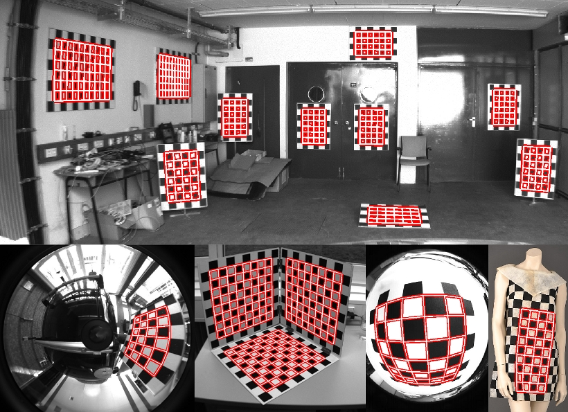
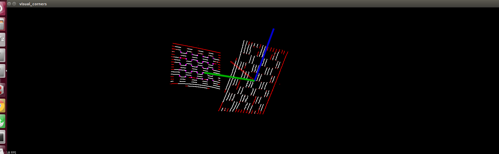
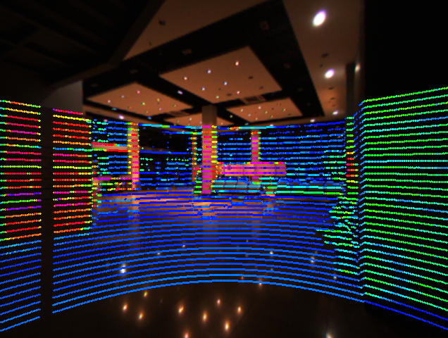
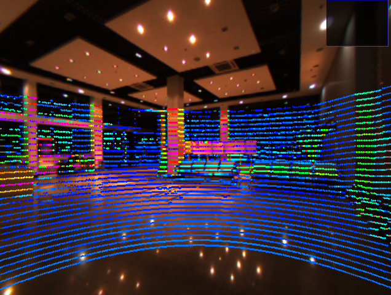
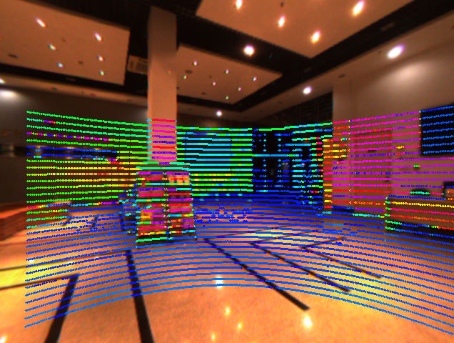
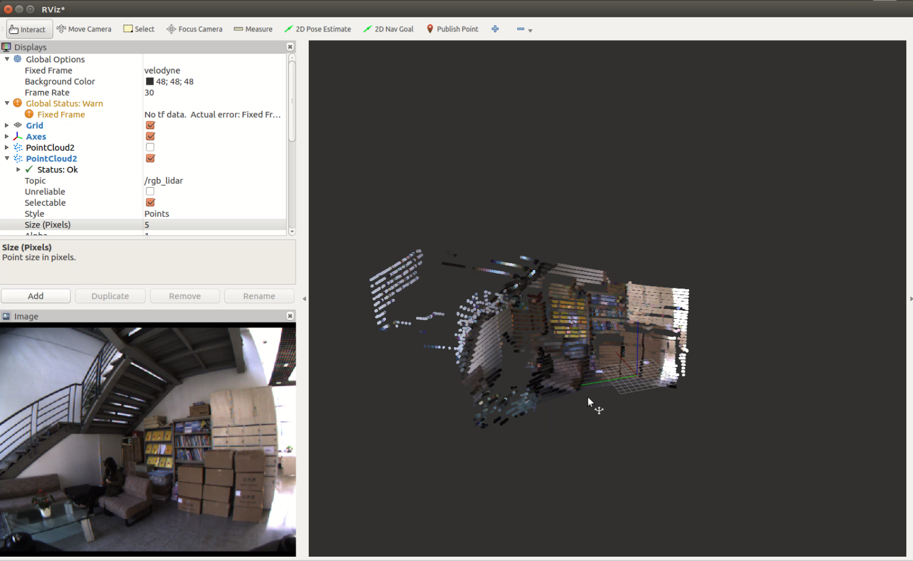
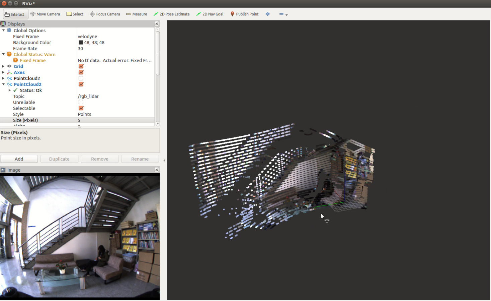
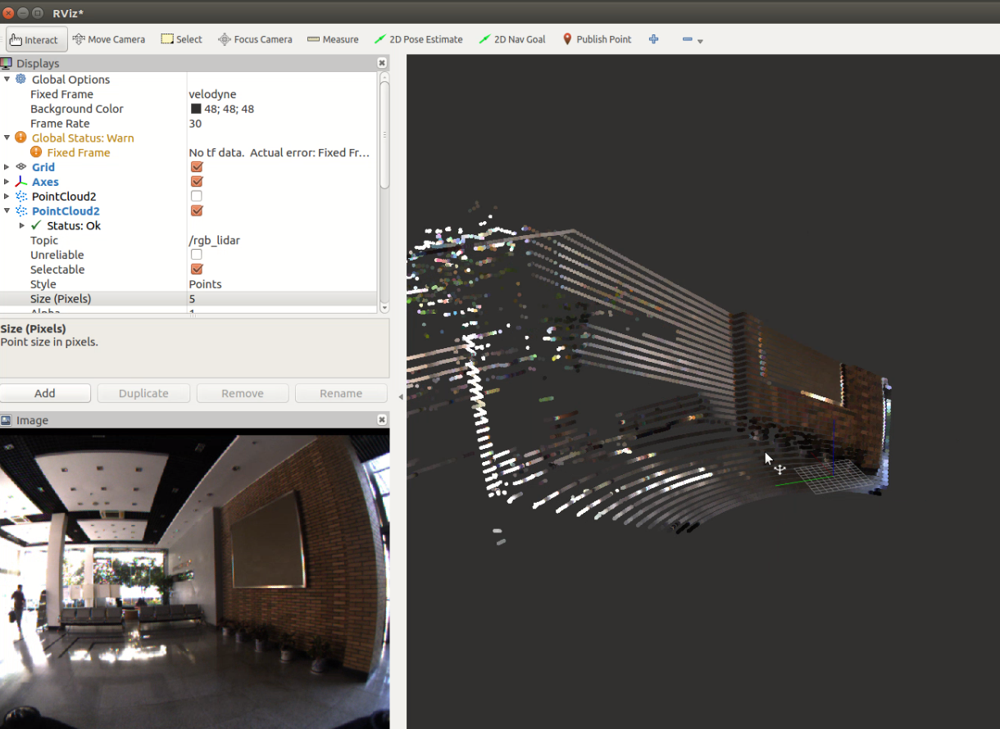

# lidar_camera_calib

### 图像提取标定板角点libcbdetect

 opencv提取标定板的方法和 [camodocal](https://github.com/hengli/camodocal) 提取标定板对图像有一定要求，而[LIBCBDETECT](http://www.cvlibs.net/software/libcbdetect/)几乎可以百分百提取出标定板。所以用的是matlab版的libcbdetect。cpp版本[在这里](https://gitee.com/csc105_slam_group/libcbdetect_cpp)。

### 激光提取标定板角点ilcc2

参考[ILCC](https://github.com/mfxox/ILCC)

这里重新用cpp实现。

### 激光投影回相机效果

### 相机投影到激光

