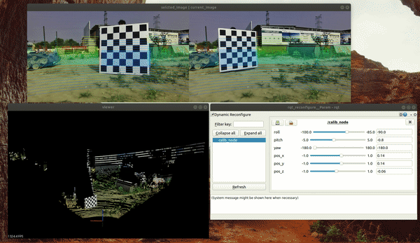
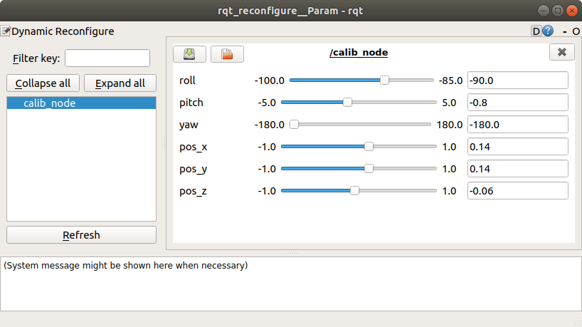
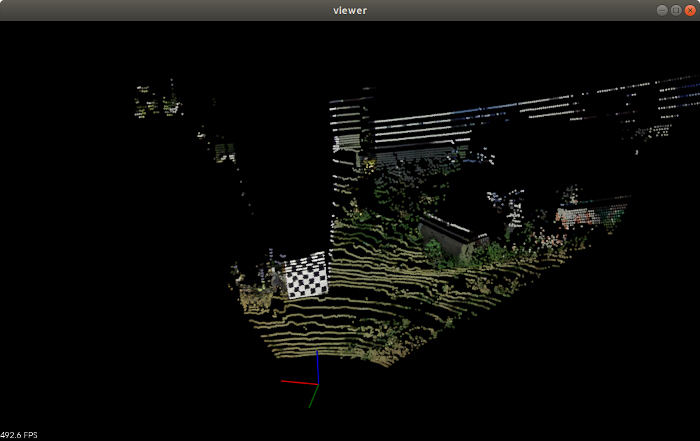
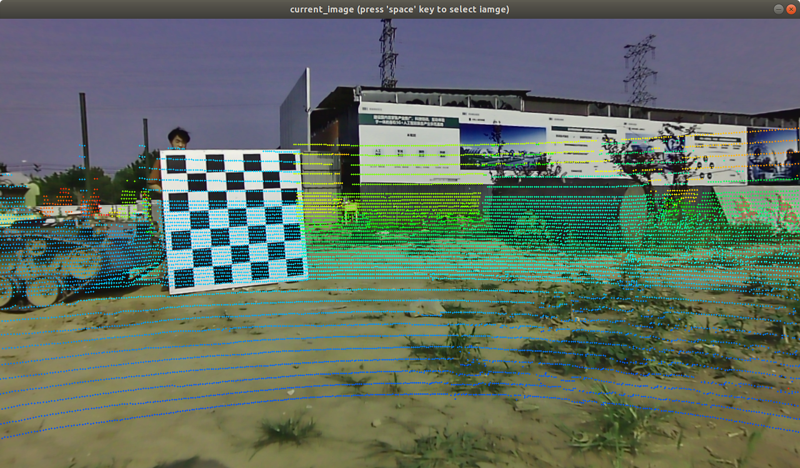
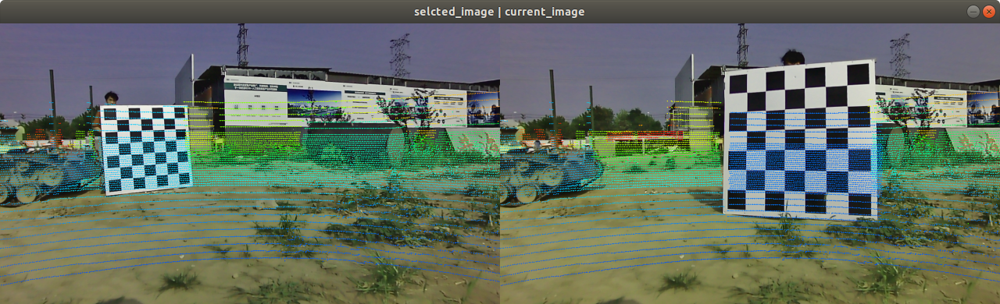

# lidar_camera_calib

基于人眼反馈的激光相机外参标定方法。



### 1.基本思想

基于图像给点云上色结果、激光投影至图像的可视化结果，手动调整6DoF外参，得到标定结果。

手动调整参数基于 ros 的 dynamic config 实现。

### 2. 标定流程

1. 修改 `config` 目录下相机参数。
2. 修改 `cfg/Locator.cfg` 文件中下，外参的初始值、外参调整上下限范围。
3. 运行`calib_node.launch`前，注意可修改点云投影范围参数`cloud_max_distance`（默认值设置为30米），相机、激光的topic。

```shell
roslaunch ilcc2 calib_node.launch
```

4. 运行程序后，播放数据包。可以通过 `rosbag play -h` 查看各个参数的意思。

   ```
   rosbag play 2_1.bag -l -s 35 -u 5
   ```

   - `-s` 数据包从第几秒开始播放；
   - `-u` 数据包播放时长（秒）；
   - `-l` 循环播放数据包；

程序会弹出三个界面，分别是

- `rqt_reconfigure` 界面，可实时调整外参参数（lidar2cam）；

  

- `viewer`界面，显示上色后的彩色激光点云；

  

- `image` 界面，显示激光投影至图像的结果，激光颜色按距离上色；

  - 当前帧实时投影结果

  

  - 为了展示多视角的投影结果，按**空格键**会保存当前视角的激光、相机数据，并在图像的左半部分显示；右半部分则实时显示订阅到的图像、激光数据。注意，可以不断的按空格键更换左半部分数据。

    

不断的在`rqt_reconfigure` 界面调整外参，观察投影结果，判断标定是否准确。

最终的标定结果会在`ctrl+C` 结束程序后在终端输出。


